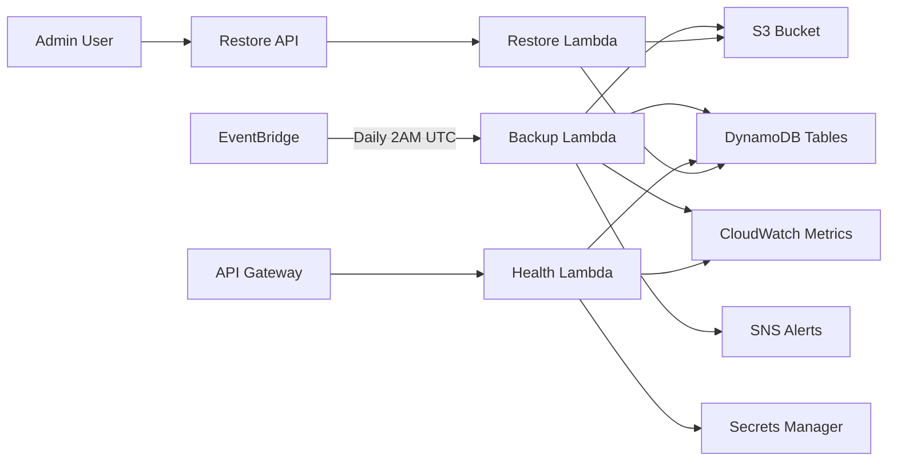

# Week 1 Security & Reliability - Implementation Guide

## Table of Contents
1. [Overview](#overview)
2. [Architecture Changes](#architecture-changes)
3. [Implementation Details](#implementation-details)
4. [Deployment Guide](#deployment-guide)
5. [Testing & Validation](#testing--validation)
6. [Troubleshooting](#troubleshooting)
7. [Cost Analysis](#cost-analysis)

## Overview

This guide provides detailed implementation instructions for the Week 1 security and reliability enhancements to the GetComplical platform. These changes add enterprise-grade data protection, monitoring, and disaster recovery capabilities.

### Components Implemented
- ✅ DynamoDB Point-in-Time Recovery (PITR) on all tables
- ✅ Health check endpoint with authentication
- ✅ AWS Secrets Manager integration
- ✅ Automated backup system with restore capability

## Architecture Changes

### New Infrastructure Components

```
GetComplical Infrastructure (Week 1 Additions)
├── Secrets Stack (NEW)
│   ├── Health Check Key Secret
│   └── API Configuration Secret
├── Storage Stack (UPDATED)
│   └── PITR enabled on all tables
├── API Compute Stack (UPDATED)
│   └── Health Check Lambda Function
└── Backup Stack (NEW)
    ├── Backup Lambda Function
    ├── Restore Lambda Function
    ├── S3 Backup Bucket
    ├── SNS Alert Topic
    └── EventBridge Scheduled Rule
```

### Data Flow



## Implementation Details

### 1. DynamoDB Point-in-Time Recovery

**File**: `infrastructure/lib/storage-stack.ts`

```typescript
// Added to all table definitions
pointInTimeRecoverySpecification: {
  pointInTimeRecoveryEnabled: true,
}
```

**Tables Updated**:
- `getcomplical-api-keys` - API key management
- `getcomplical-tax-data` - Tax calendar data  
- `getcomplical-rate-limits` - Rate limiting data (NEW - was missing PITR)

### 2. Health Check Endpoint

**New File**: `lambdas/api/health.ts`

**Key Features**:
```typescript
// Basic health check (public)
GET /health

// Deep health check (authenticated)
GET /health?deep=true
Headers: x-health-check-key: <secret-from-secrets-manager>
```

**Health Checks Performed**:
- Environment variable validation
- DynamoDB table status and metrics
- Lambda error rates (last 5 minutes)
- System information

**Security Implementation**:
```typescript
// Secret fetched at runtime, not stored in env vars
async function getHealthCheckKey(): Promise<string> {
  if (cachedHealthCheckKey) {
    return cachedHealthCheckKey;
  }
  
  const command = new GetSecretValueCommand({
    SecretId: process.env.HEALTH_CHECK_SECRET_ARN,
  });
  const response = await secretsClient.send(command);
  const secret = JSON.parse(response.SecretString);
  cachedHealthCheckKey = secret.key;
  return cachedHealthCheckKey;
}
```

### 3. AWS Secrets Manager Integration

**New File**: `infrastructure/lib/secrets-stack.ts`

**Secrets Created**:

1. **Health Check Key** (`getcomplical/health-check-key`)
```json
{
  "key": "<auto-generated-32-char-key>"
}
```

2. **API Configuration** (`getcomplical/api-config`)
```json
{
  "apiKeyPrefix": "gc_live_",
  "dashboardDomain": "https://api.getcomplical.com",
  "supportEmail": "support@getcomplical.com",
  "stripeApiKey": "placeholder",
  "sendgridApiKey": "placeholder",
  "slackWebhookUrl": "placeholder"
}
```

**Important Note**: The `HEALTH_CHECK_KEY: 'will-be-set-by-secret'` in the Lambda environment is a placeholder. The actual key is fetched from Secrets Manager at runtime for better security.

### 4. Automated Backup System

**New Files**:
- `lambdas/backup/dynamodb-backup.ts` - Backup function
- `lambdas/backup/dynamodb-restore.ts` - Restore function
- `infrastructure/lib/backup-stack.ts` - Infrastructure

**Backup Schedule**: Daily at 2 AM UTC via EventBridge

**S3 Structure**:
```
getcomplical-backups-{account}-{region}/
└── dynamodb-backups/
    ├── getcomplical-api-keys/
    │   └── 2025/07/06/getcomplical-api-keys-2025-07-06T02-00-00-000Z.json
    └── getcomplical-tax-data/
        └── 2025/07/06/getcomplical-tax-data-2025-07-06T02-00-00-000Z.json
```

**Lifecycle Policy**:
- 30 days: Transition to Glacier
- 90 days: Expire and delete
- Versioning enabled for additional protection

**Restore API**:
```typescript
POST /restore
Authorization: Bearer <cognito-token>
{
  "tableName": "getcomplical-api-keys",
  "backupDate": "2025-07-06",  // Optional
  "s3Key": "dynamodb-backups/...", // Optional
  "dryRun": true  // Optional
}
```

## Deployment Guide

### Prerequisites
1. AWS CDK CLI installed (`npm install -g aws-cdk`)
2. AWS credentials configured
3. Node.js 20.x installed

### Step-by-Step Deployment

```bash
# 1. Install dependencies
cd getcomplical-dev
npm install

# 2. Build the project
npm run build

# 3. Deploy stacks in order
# Secrets must be deployed first
cdk deploy GetComplicalSecretsStack --require-approval never

# Storage with PITR updates
cdk deploy GetComplicalStorageStack --require-approval never

# API with health endpoint
cdk deploy GetComplicalApiComputeStack --require-approval never

# Backup system
cdk deploy GetComplicalBackupStack --require-approval never

# Optional: Add alert email
cdk deploy GetComplicalBackupStack -c alertEmail=ops@getcomplical.com --require-approval never
```

### Post-Deployment Configuration

1. **Retrieve Health Check Key**:
```bash
aws secretsmanager get-secret-value \
  --secret-id getcomplical/health-check-key \
  --query SecretString \
  --output text | jq -r .key
```

2. **Verify Backup Bucket**:
```bash
aws s3 ls s3://getcomplical-backups-${ACCOUNT}-${REGION}/
```

3. **Test Health Endpoint**:
```bash
# Basic check
curl https://${CLOUDFRONT_DOMAIN}/health

# Deep check
curl -H "x-health-check-key: ${HEALTH_KEY}" \
  https://${CLOUDFRONT_DOMAIN}/health?deep=true
```

## Testing & Validation

### 1. PITR Validation
```bash
# Check PITR status
aws dynamodb describe-continuous-backups \
  --table-name getcomplical-api-keys

# Expected output should show:
# "PointInTimeRecoveryStatus": "ENABLED"
```

### 2. Health Check Testing
```bash
# Test script
#!/bin/bash
DOMAIN="your-cloudfront-domain"
KEY=$(aws secretsmanager get-secret-value \
  --secret-id getcomplical/health-check-key \
  --query SecretString --output text | jq -r .key)

echo "Testing basic health..."
curl -s https://${DOMAIN}/health | jq .

echo "Testing deep health..."
curl -s -H "x-health-check-key: ${KEY}" \
  https://${DOMAIN}/health?deep=true | jq .
```

### 3. Backup Testing
```bash
# Manually trigger backup
aws lambda invoke \
  --function-name GetComplicalBackupStack-BackupFunction* \
  --payload '{}' \
  output.json

cat output.json | jq .

# Check S3 for backup files
aws s3 ls s3://getcomplical-backups-${ACCOUNT}-${REGION}/dynamodb-backups/ --recursive
```

### 4. Restore Testing (Dry Run)
```bash
# Get Cognito token first
TOKEN="your-cognito-token"

# Test restore dry run
curl -X POST https://${RESTORE_API_URL}/restore \
  -H "Authorization: Bearer ${TOKEN}" \
  -H "Content-Type: application/json" \
  -d '{
    "tableName": "getcomplical-api-keys",
    "dryRun": true
  }'
```

## Troubleshooting

### Common Issues

1. **Health Check Returns 503**
   - Check CloudWatch Logs for the health Lambda
   - Verify all environment variables are set
   - Check IAM permissions for DynamoDB access

2. **Backup Fails**
   - Check S3 bucket permissions
   - Verify DynamoDB read permissions
   - Check Lambda timeout (should be 15 minutes)
   - Review CloudWatch Logs

3. **Secrets Manager Access Denied**
   - Verify Lambda has secretsmanager:GetSecretValue permission
   - Check secret ARN is correct
   - Ensure secret exists in the same region

4. **Restore Fails**
   - Verify Cognito authentication is working
   - Check S3 read permissions
   - Verify DynamoDB write permissions
   - Check backup file format is valid JSON

### Debug Commands

```bash
# Check Lambda logs
aws logs tail /aws/lambda/GetComplicalApiComputeStack-HealthFunction* --follow

# Check backup metrics
aws cloudwatch get-metric-statistics \
  --namespace GetComplical/Backup \
  --metric-name BackupSuccess \
  --dimensions Name=TableName,Value=getcomplical-api-keys \
  --start-time 2025-07-05T00:00:00Z \
  --end-time 2025-07-06T23:59:59Z \
  --period 86400 \
  --statistics Sum

# List secrets
aws secretsmanager list-secrets --filters Key=name,Values=getcomplical
```

## Cost Analysis

### Estimated Monthly Costs

| Service | Cost Driver | Estimated Cost |
|---------|------------|----------------|
| DynamoDB PITR | $0.20/GB stored | ~$2-5 |
| S3 Backup Storage | $0.023/GB (Standard) | ~$1-3 |
| S3 Backup Storage | $0.004/GB (Glacier after 30d) | ~$0.50 |
| Lambda Executions | Daily backups + health checks | ~$1-2 |
| Secrets Manager | $0.40/secret/month | $0.80 |
| CloudWatch Logs | Storage + ingestion | ~$1-2 |
| **Total** | | **~$6-13/month** |

### Cost Optimization Tips

1. **Adjust Backup Retention**:
   - Reduce from 90 to 30 days if appropriate
   - Transition to Glacier earlier (e.g., after 7 days)

2. **Optimize Lambda Memory**:
   - Monitor actual usage and reduce if over-provisioned
   - Current: 1024MB for backup, 256MB for health

3. **CloudWatch Logs Retention**:
   - Set retention policy on Lambda log groups
   - Consider 7-14 days for non-critical logs

## Security Best Practices

1. **Secrets Rotation**:
   - Implement automatic rotation for health check key
   - Rotate every 90 days minimum

2. **Least Privilege**:
   - Review IAM roles and remove unnecessary permissions
   - Use separate roles for backup and restore

3. **Monitoring**:
   - Set up CloudWatch alarms for backup failures
   - Monitor unauthorized health check attempts
   - Track restore API usage

4. **Compliance**:
   - Document backup/restore procedures
   - Test restore process quarterly
   - Maintain audit logs of all restore operations

## Next Steps

### Immediate Actions
1. Configure SNS email alerts for backup failures
2. Create CloudWatch dashboard for backup metrics
3. Document runbook for restore procedures
4. Schedule quarterly restore drills

### Future Enhancements
1. Implement cross-region backup replication
2. Add backup encryption with customer-managed keys
3. Create automated backup validation
4. Implement backup integrity checksums
5. Add Slack/PagerDuty integration for alerts

## Conclusion

The Week 1 implementation provides a solid foundation for data protection and operational visibility. The combination of PITR and S3 backups ensures multiple recovery options, while the health check endpoint enables proactive monitoring. All sensitive configuration is now managed through AWS Secrets Manager, following security best practices.